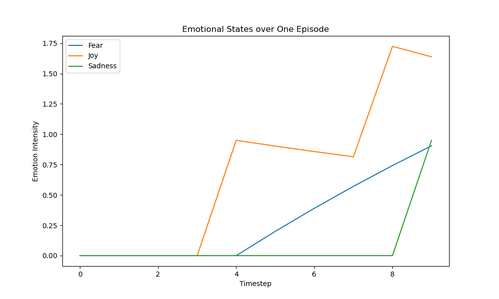

# Emotional RL Agents: Tracking Mood in Python Games
Uses the OpenAI API to create and test simple Python games. Next, trains a recurrent PPO agent (using RecurrentPPO with an MlpLstmPolicy from sb3-contrib) to play these games and track the agent’s "mood"-its evolving emotional states such as fear, joy, and sadness. The goal is to analyze how these emotional trajectories differ between successful games (like the popular Snake) and less successful ones.

